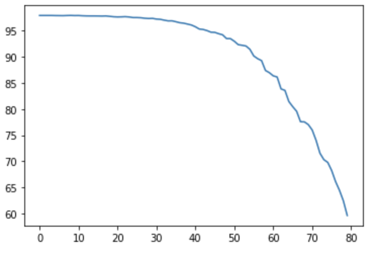
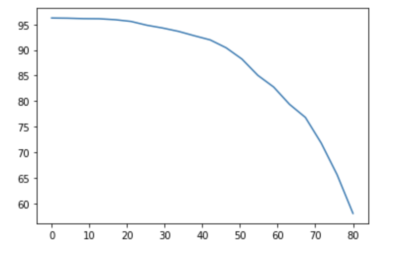

# ML_PROJECT

## Fine-pruning
To run the repair badnet1 using fine-pruning:

`python3 repair_badnet1_fine_prune.py clean_validation_data poisoned_data test_data bad_net`

E.g., `python3 repair_badnet1_fine_prune.py clean_validation_data.h5 sunglasses_poisoned_data.h5 test_data.h5 CSAW-HackML-2020-master/models/sunglasses_bd_net.h5`

To run the repair badnet2 using fine-pruning:

`python3 repair_badnet2_fine_prune.py clean_validation_data test_data bad_net`

E.g., `python3 repair_badnet2_fine_prune.py clean_validation_data.h5 test_data.h5 CSAW-HackML-2020-master/models/anonymous_bd_net.h5`

Results show:

Backdoor data neuron activation:

Clean data neuron activation:

Pruned_neurons to prediction accuracy on validation data with bad net 1:

Pruned_neurons to prediction accuracy on validation data with bad net 2:

