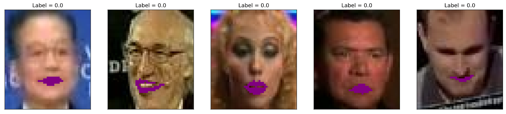
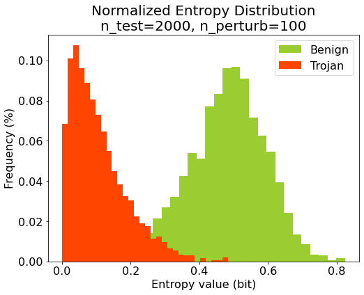
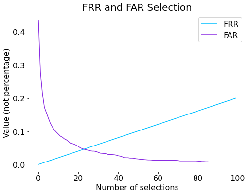
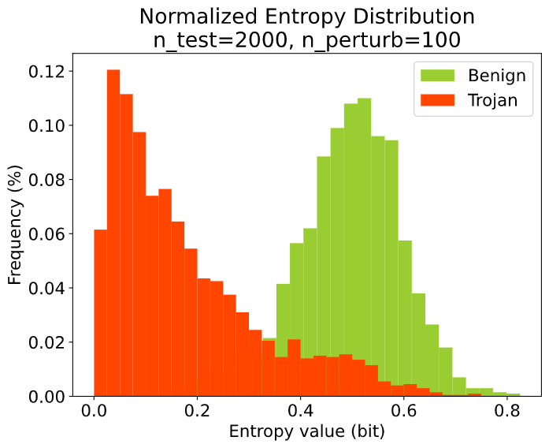
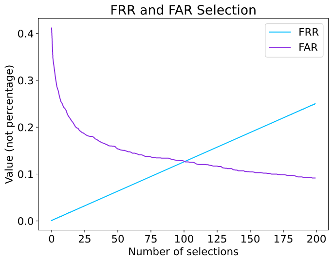
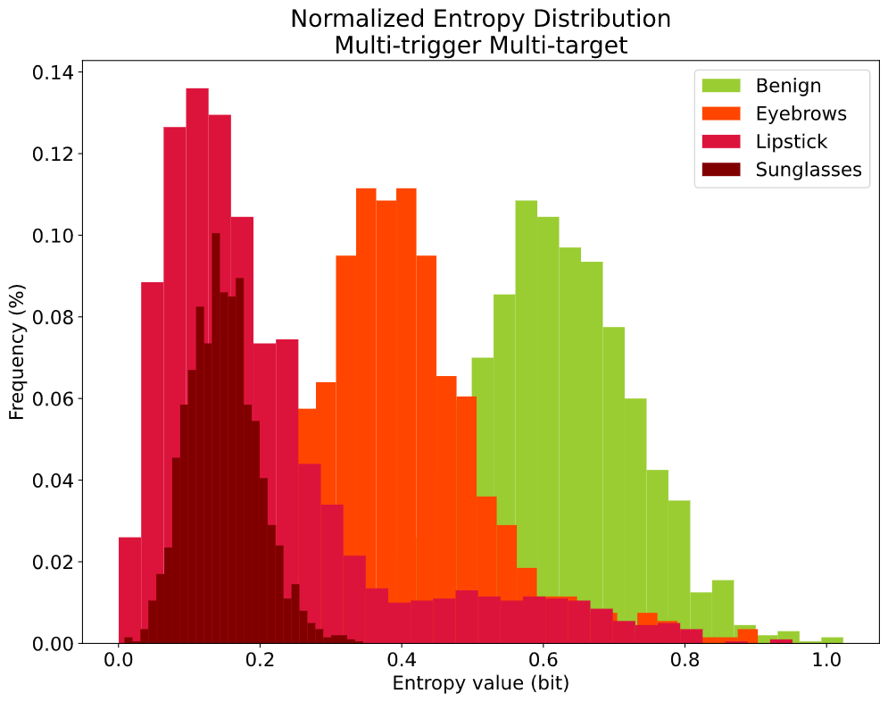
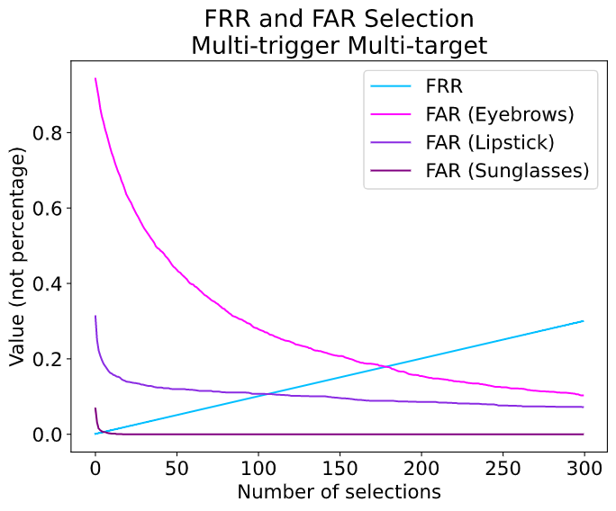

# ML_PROJECT

## Fine-pruning
To evaluate the repaired badnet please run:

`python3 eval_repaired_badnet.py clean_validation_data single_test_image  repaired_badnet original_badnet`

E.g., `python3 eval_repaired_badnet.py clean_validation_data.h5 test_image.png model/repaired_badnet1.h5 old_model/sunglasses_bd_net.h5`

Just change the repaired_badnet and the corresponding old model and run the eval_repaired_badnet.py for other badnet
| Model File Name                      | Repaired Badnet number         |
| ------------------------------------ | ------------------------------ |
| sunglasses_bd_net.h5                 | repaired_badnet1               |
| anonymous_1_bd_net.h5                | repaired_badnet2               |
| anonymous_2_bd_net.h5                | repaired_badnet3               |
| multi_trigger_multi_target_bd_net.h5 | repaired_badnet4               |

Results show:

Backdoor data neuron activation:


Clean data neuron activation:


Pruned_neurons to prediction accuracy on validation data with bad net 1:


Pruned_neurons to prediction accuracy on validation data with bad net 2:


## STRIP

### Naming

| Model File Name                      | BadNet Number in STRIP Section |
| ------------------------------------ | ------------------------------ |
| sunglasses_bd_net.h5                 | BadNet1                        |
| anonymous_1_bd_net.h5                | BadNet2                        |
| multi_trigger_multi_target_bd_net.h5 | BadNet3                        |
| anonymous_2_bd_net.h5                | BadNet4                        |

### Usage

To repair BadNet1, BadNet2 and BadNet3 using STRIP:

```shell
python repair_badnet1_strip.py clean_validation_data poisoned_data clean_test_data badnet badnet_weights
```

```shell
python repair_badnet2_strip.py clean_validation_data poisoned_data clean_test_data badnet badnet_weights
```

```shell
python repair_badnet3_strip.py clean_validation_data poisoned_data clean_test_data badnet badnet_weights
```

E.g.

```shell
python repair_badnet1_strip.py data/clean_validation_data.h5 data/sunglasses_poisoned_data.h5 data/clean_test_data.h5 models/sunglasses_bd_net.h5 models/sunglasses_bd_weights.h5
```

To repair BadNet4 using STRIP:

```shell
python repair_badnet4_strip.py clean_validation_data clean_test_data badnet badnet_weights
```

E.g.

```shell
python repair_badnet4_strip.py data/clean_validation_data.h5 data/clean_test_data.h5 models/anonymous_2_bd_net.h5 models/anonymous_2_bd_weights.h5
```

### Figures

The figures are downloaded from Jupyter notebook of this project.

#### Provided Datasets

Clean sample:


Sunglasses sample:


Eyebrows sample:


Anonymous 1 (Lipstick) sample:



Another sunglasses sample:


#### BadNet1 (Sunglasses)

Perturbation demo:


Entropy distribution of perturbed clean (benign) and poisoned (trojan) samples.



False Rejection Rate (FRR), False Acceptance Rate (FAR) relationship curve.




#### BadNet2 (Anonymous 1)

Perturbation demo:


Entropy distribution of perturbed clean samples.



FRR and FAR relationship curve.




#### BadNet3 (Multi-trigger Multi-target)

Entropy distribution of perturbed clean (benign) and poisoned (trojan) samples.



FRR and FAR relationship curve.



#### BadNet4 (Anonymous 2)

Since the poisoned data is not available for this badnet, we have tried 2 entropy threshold values. Please refer to the performance table below.

### Performance Table

This table shows the accuracy of repaired badnet on provided clean validation dataset *clean_validation_data.h5*.

| Repaired BadNet | Entropy threshold       | Accuracy                |
| --------------- | ----------------------- | ----------------------- |
| BadNet1         | 0.2942637391590416      | 91.63419069888282%      |
| BadNet2         | 0.32472740328754        | 91.02797263358449%      |
| BadNet3         | 0.49712885268670665     | 77.69983545509657%      |
| BadNet4         | 0.2942637391590416      | 91.8333766346237%       |
| ~~BadNet4~~     | ~~0.49712885268670665~~ | ~~40.374123148869835%~~ |

For more detailed explanation and performance about code, please refer to Jupyter Notebook **STRIP.ipynb** (PDF version also available) and our project report.
