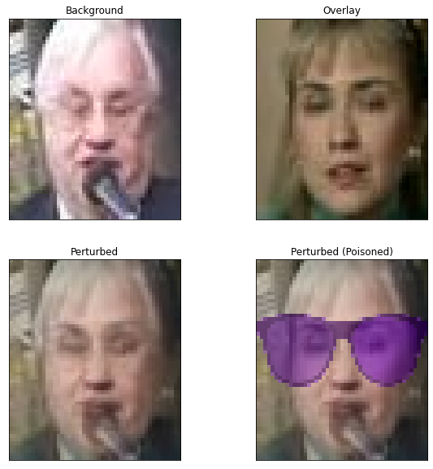
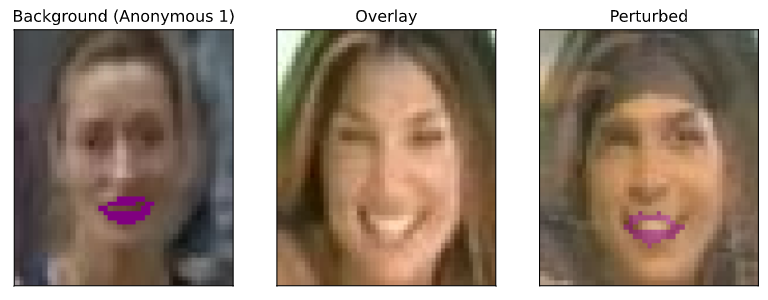

# ML PROJECT FOR ECE-GY 9163

## STRIP

### Usage & Naming

To get the prediction result of **a single image** from repaired BadNets using STRIP:

```shell
python repair_badnet[1 | 2 | 3 | 4]_strip.py single_test_image clean_data badnet badnet_weights
```

E.g.

```shell
python repair_badnet1_strip.py data/PNGs/Sunglasses_0_1.png data/clean_validation_data.h5 models/sunglasses_bd_net.h5 models/sunglasses_bd_weights.h5
```

The relationship of Python program name, BadNet model file name and BadNet numbers in STRIP section are provided in the table below. Please change the program name when using different models.

| Python Program          | Model File Name                      | BadNet No. |
| ----------------------- | ------------------------------------ | ---------- |
| repair_badnet1_strip.py | sunglasses_bd_net.h5                 | BadNet1    |
| repair_badnet2_strip.py | anonymous_1_bd_net.h5                | BadNet2    |
| repair_badnet3_strip.py | multi_trigger_multi_target_bd_net.h5 | BadNet3    |
| repair_badnet4_strip.py | anonymous_2_bd_net.h5                | BadNet4    |

### Figures

The figures are downloaded from Jupyter notebook of this project.

#### Provided Datasets

Clean sample:


Sunglasses sample:


Eyebrows sample:


Anonymous 1 (Lipstick) sample:


Another sunglasses sample:


#### BadNet1 (Sunglasses)

Perturbation demo:



Entropy distribution of perturbed clean (benign) and poisoned (trojan) samples.


False Rejection Rate (FRR), False Acceptance Rate (FAR) relationship curve.


#### BadNet2 (Anonymous 1)

Perturbation demo:



Entropy distribution of perturbed clean samples.


FRR and FAR relationship curve.


#### BadNet3 (Multi-trigger Multi-target)

Entropy distribution of perturbed clean (benign) and poisoned (trojan) samples.


FRR and FAR relationship curve.


#### BadNet4 (Anonymous 2)

Since the poisoned data is not available for this badnet, we have tried 2 entropy threshold values. More details available in the performance table below.

### Performance Table

This table shows the accuracy of repaired badnet on provided clean validation dataset *clean_validation_data.h5*.

| Repaired BadNet | Entropy threshold       | Accuracy                |
| --------------- | ----------------------- | ----------------------- |
| BadNet1         | 0.2942637391590416      | 91.63419069888282%      |
| BadNet2         | 0.32472740328754        | 91.02797263358449%      |
| BadNet3         | 0.49712885268670665     | 77.69983545509657%      |
| BadNet4         | 0.2942637391590416      | 91.8333766346237%       |
| ~~BadNet4~~     | ~~0.49712885268670665~~ | ~~40.374123148869835%~~ |

For more detailed explanation and performance about code, please refer to Jupyter Notebook **STRIP.ipynb** (PDF version also available) and our project report.

## Fine-pruning
To evaluate the repaired badnet please run:

`python3 repair_badnet1_fine_prune.py clean_validation_data single_test_image  repaired_badnet original_badnet`

E.g., `python3 repair_badnet1_fine_prune.py clean_validation_data.h5 test_image.png model/repaired_badnet1.h5 old_model/sunglasses_bd_net.h5`

Just change the python program name, repaired_badnet and the corresponding old model for other badnet
|Python program                        | Model File Name                      | Repaired Badnet number         |
| -------------------------------------| ------------------------------------ | ------------------------------ |
|repair_badnet1_fine_prune.py          | sunglasses_bd_net.h5                 | repaired_badnet1               |
|repair_badnet2_fine_prune.py          | anonymous_1_bd_net.h5                | repaired_badnet2               |
|repair_badnet3_fine_prune.py          | anonymous_2_bd_net.h5                | repaired_badnet3               |
|repair_badnet4_fine_prune.py          | multi_trigger_multi_target_bd_net.h5 | repaired_badnet4               |

Results show:

Backdoor data neuron activation:


Clean data neuron activation:


Pruned_neurons to prediction accuracy on validation data with bad net 1:


Pruned_neurons to prediction accuracy on validation data with bad net 2:


